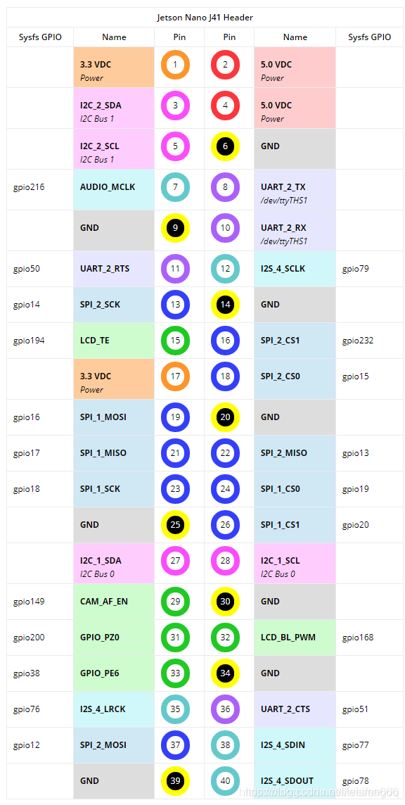

# Examples for interfacing with the Jetson 

## BirdsEyeView.py
Follow this section to run a Birds Eye View transformation for a given image. This can be paired with the circles_test.py script above to perform a more precise DWA calculation, as this is a direct top-down measurement, rather than an extrapolated one. In other words, when we command a robot, we usually tell it how to move from a top-down reference frame, however we are taking a front-facing image with the Realsense. To get the most accurate measurements and hence the most accurate commands, use this transformation. Again, this program does not use motor commands as this is a purely visual aid.

You will need to pip install the following packages before running the code in python:
1. `pip install opencv-python`
2. `pip install numpy`
3. `pip install matplotlib`
4. `pip install pyrealsense2`
5. `pip install imutils`
6. `pip install python-math`

On top of this, there are two ways to get the Realsense to work with python. The first is as mentioned above by "pip install pyrealsense2", but may require a virtual environment. The second involves following this github instruction set for the jetson. Follow [this link](https://dev.intelrealsense.com/docs/nvidia-jetson-tx2-installation) closely to install the Realsense packages natively.

From here, plug in the Realsense via USB and run the python BirdsEyeView.py script. There is a calibration board in the V308 closet if you need to change parameters to get a perfect top-down perspective.

## motor_test.py
Follow this section to gain an understanding of how to command the motors using Simple Serial Mode. The script provided cycles the speeds of the left and right motors through a for loop.

You will need to pip install the following packages before running the code in python:
1. `pip install pyserial`
2. the `time` module is used, but is already part of python's standard packages so this does not need to be pip'd

__Using the Sabertooth 2x12 datasheet, set to Simple Serial and the baud rate to 9600 by adjusting the dip switches. Prop the robot up on a box so that the wheels do not touch the ground, otherwise it will run away when the script is ran! Here no sensors are used, this is used for testing the motors and seeing how commands are sent.__

## GPIO.py 
Follow this section to test and understand the GPIO pins on the Jetson. This script currently uses a button input and an LED output to turn on the LED when the button is pressed. The debouncing is not fantastic, it could be better, but it's just a practice example. 
You will need to pip install the following packages:
1. `pip install RPi.GPIO`
2. `pip install Jetson.GPIO`
3. This again uses the `time` module.

The Jetson GPIO Package is finnickey. There is a [repo](https://github.com/NVIDIA/jetson-gpio.git) with more information on it. `RPi.GPIO` worked better for us. 

Connect the LED to ground and board pin 12. Connect the button across ground and the input pin 18. Run the script using a `venv` in vscode or via the command line. The pinout we used is shown below, we're not confident it's entirely correct as we used the YAHBOOM dev kit with the Jetson, so you may just have to plug and play with which GPIO pins you can use. The ground, 5V supply, and 3.3V supply are all correct however, you'll see that they are a different color on the board. 

## PWM.py 
This is the script we used for PWM on the jetson. The goal was to have the linear actuator and drill be connected to these pins and have them be able to have their speed adjusted using PWM in place of an analog signal. PWM on the jetson sucks. It only goes up to ~1.5 V and has proven very difficult to amplify. In the automation folder, you'll see that we just did digital HIGH outputs to trigger an arduino nano to do the PWM for us. In order to ensure your pins are PWM capable, use the command `sudo /opt/nvidia/jetson-io/jetson-io.py`
This will bring you to a screen that will have options for making pins PWM capable. The ones with asterisks in the brackets are the pins capable of PWM. 

## realtime.py
This is a combonation of the Realsense code and the circles_test script. This connects to the realsense, opens a CV session to display the realsense's feed in real time. With the correct weights file, the machine will draw a bounding box around the items it is trained on. It will also show you a depth map and give you a reading of the depth of the object it's drawn the bounding box on. 

You'll need some packages to run this script, 
1. `pip install opencv-python`
2. `pip install numpy`
3. `pip install ultralytics`
4. `pip install pyrealsense2`
5. `pip install serial`
6. `pip install python-math`

You can run the script in a venv or using the command line. 

## circles_test.py
Follow this section to run the Dynamic Window Approach to collision avoidance, with object detection from a standard package. In other words, this program will detect an object, find the middle of the bounding box, and navigate around it. There are no motor commands here as this is a purely visual aid.

You will need to pip install the following packages before running the code in python:
1. `pip install opencv-python`
2. `pip install numpy`
3. `pip install matplotlib`
4. `pip install pyrealsense2`
5. `pip install imutils`

On top of this, there are two ways to get the Realsense to work with python. The first is as mentioned above by "pip install pyrealsense2", but may require a virtual environment. The second involves following this github instruction set for the jetson. Follow [this link](https://dev.intelrealsense.com/docs/nvidia-jetson-tx2-installation) closely to install the Realsense packages natively.

From here, plug in the Realsense via USB and run the python `circles_test.py` script.

